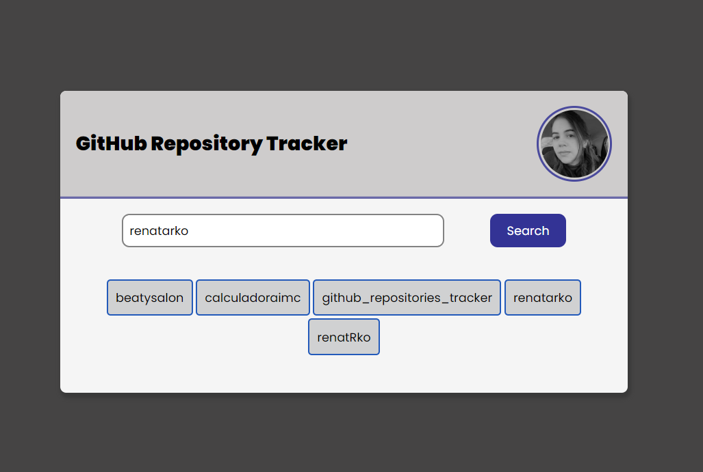

## GitHub Repository Tracker

 💻 Projeto que lista os repositórios dos usuários do GitHub.

---

🧠🤯 Desenvolvido para aprendizado das features da linguagem do JavaScript, como:
* JavaScript async: promises, async/await
* try/catch
* for, forEach, map
* funções puras

---

Feito ❤️ por Renata Karolina 